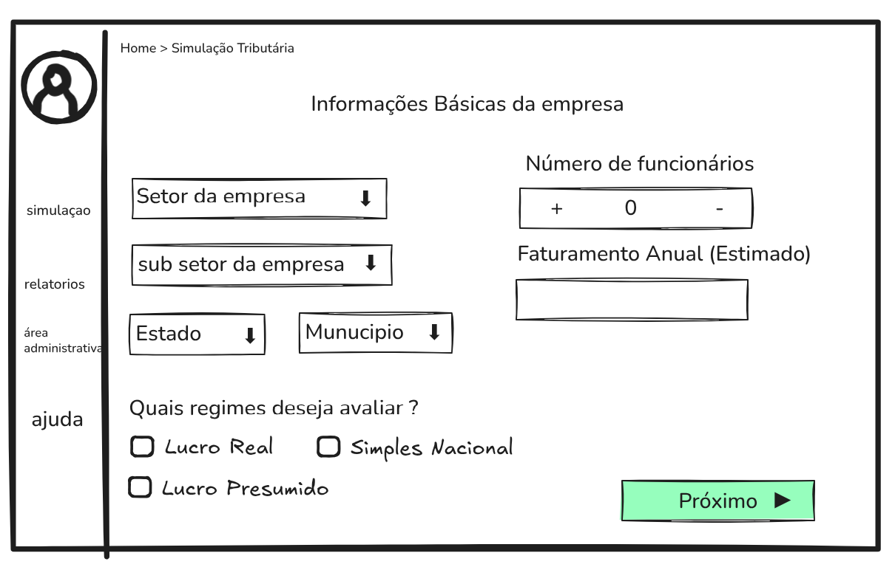
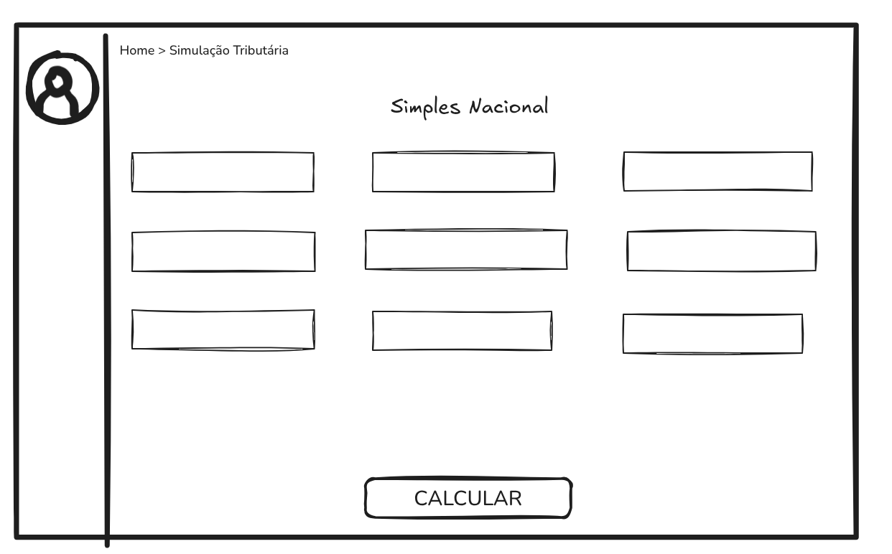
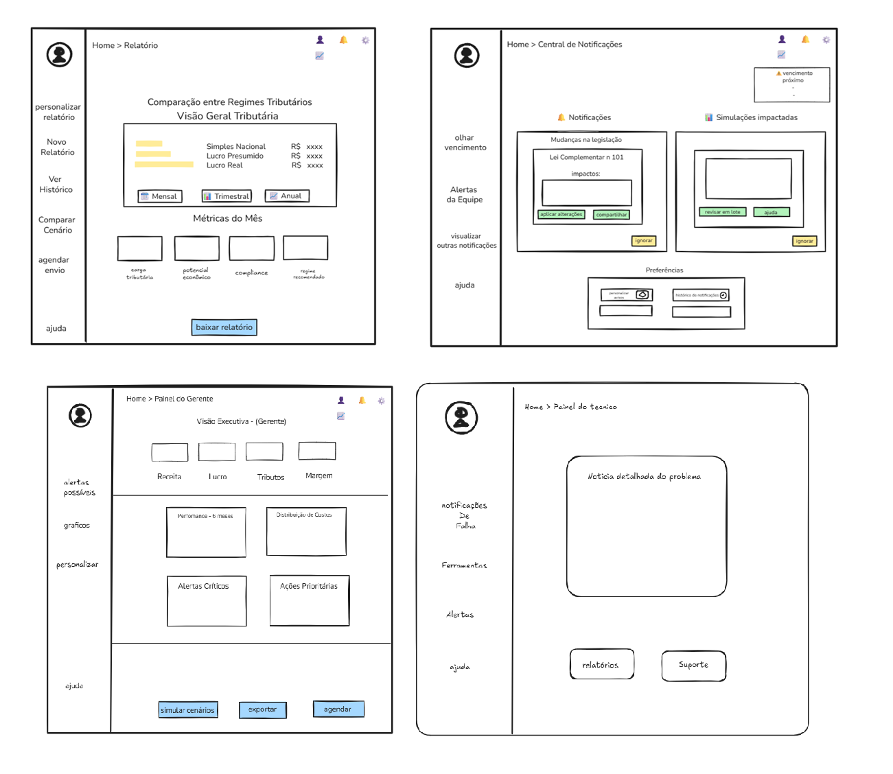

# Requisitos de Software

## Sistema de simulação tributária (SST)

<small>Versão 2.1</small>

---

## Histórico de revisões

| Data | Versão | Descrição | Autor |
| ---- | ------ | --------- | ----- |
| 07/11/2025 | 1.0 | Criação do documento | Arthur Araújo |
| 08/11/2025 | 1.1 | Adição dos requisitos funcionais de Calculo e Simulação | Davi Leite |
| 09/11/2025 | 1.2 | Adição dos requisitos funcionais de Relatorio e Notificações | Gabriel Pereira |
| 09/11/2025 | 1.3 | Adição dos requisitos funcionais de Atualização de Legislação e Aliquotas | Davi Leite |
| 09/11/2025 | 1.4 | Adição dos requisitos não-funcionais de Usabilidade e Suportabilidade | Davi Leite |
| 09/11/2025 | 1.4.1 | Correção da marcação da versao atual do Sistema e adição do sumário | Davi Leite |
| 09/11/2025 | 1.5 | Adição dos requisitos não-funcionais de Manutenibilidade | Davi Leite |
| 09/11/2025 | 1.6 | Adição dos wireframes e protótipos iniciais | Davi Leite |
| 17/11/2025 | 1.7 | Adição da Especificação Técnica dos Cálculos Tributários | Davi Leite |
| 17/11/2025 | 1.8 | Adição dos requisitos funcionais de Integração com APIS externas | Davi Leite
| 24/11/2025 | 1.9 | Adição dos requisitos não-funcionais de Interoperabilidade | Davi Leite |
| 01/12/2025 | 2.0 | Adição dos wireframes | Gabriel Pereira de Carvalho | 
| 04/12/2025 | 2.1 | Correções solicitidas após apresentação | Arthur Araújo |
| 05/12/2025 | 2.2 | Correções solicitidas dos requisitos funcionais após apresentação | Gabriel Pereira |
| 12/12/2025 | 2.3 | Correções solicitidas dos requisitos funcionais após apresentação | Gabriel Pereira |

---

## Sumário

- [Requisitos de Software](#requisitos-de-software)
  - [Sistema de simulação tributária (SST)](#sistema-de-simulação-tributária-sst)
  - [Histórico de revisões](#histórico-de-revisões)
  - [Sumário](#sumário)
- [Introdução](#introdução)
  - [Definições, acrônimos e abreviações](#definições-acrônimos-e-abreviações)
- [Usuários identificados](#usuários-identificados)
- [Requisitos funcionais](#requisitos-funcionais)
  - [Controle de Acesso](#controle-de-acesso)
  - [Gestão de Usuários](#gestão-de-usuários)
  - [Cálculo e Simulação Tributária](#cálculo-e-simulação-tributária)
    - [Requisitos Gerais de Cálculo](#requisitos-gerais-de-cálculo)
    - [Cálculos do Simples Nacional](#cálculos-do-simples-nacional)
    - [Cálculos do Lucro Presumido](#cálculos-do-lucro-presumido)
    - [Cálculos do Lucro Real (somente Prestação de Serviços)](#cálculos-do-lucro-real-somente-prestação-de-serviços)
  - [Atualização de Legislação e Alíquotas](#atualização-de-legislação-e-alíquotas)
  - [Relatórios e Dashboards](#relatórios-e-dashboards)
    - [Relatórios de Simulações e Análises](#relatórios-de-simulações-e-análises)
  - [Administração e Infraestrutura](#administração-e-infraestrutura)
  - [Importação de Dados e Validações](#importação-de-dados-e-validações)
- [Requisitos não-funcionais](#requisitos-não-funcionais)
  - [Disponibilidade](#disponibilidade)
  - [Privacidade e segurança](#privacidade-e-segurança)
  - [Usabilidade](#usabilidade)
  - [Suportabilidade](#suportabilidade)
  - [Interoperabilidade](#interoperabilidade)
  - [Manutenibilidade](#manutenibilidade)
  - [Desempenho](#desempenho)
  - [Implantação](#implantação)
- [Wireframes e Protótipos](#wireframes-e-protótipos)
  - [Formulário de Simulação Tributária](#formulário-de-simulação-tributária)
  - [Resultados - Simples Nacional (Exemplo)](#resultados---simples-nacional-exemplo)
  - [Wireframes dos módulos AUT, GES e ADM](#wireframes-dos-módulos-aut-ges-e-adm)
  - [Wireframes dos módulos REL e NOT](#wireframes-dos-módulos-rel-e-not)

---

# Introdução

Este documento tem como objetivo apresentar os requisitos de software do produto **Sistema de simulação tributária (SST)**

## Definições, acrônimos e abreviações

Visando o melhor entendimento do documento faz-se necessário definir alguns termos, abreviações e acrônimos, o que será feito abaixo.

- Identificação dos requisitos: a referência a requisitos de software presentes nesse documento é feita através do identificador de requisitos seguindo o padrão abaixo:
  - Funcionais:
    `[IDENTIFICADOR DO TIPO REQUISITO-IDENTIFICADOR DO MÓDULO-identificador do requisito]`
  - Não funcionais:
    `[IDENTIFICADOR DO TIPO REQUISITO-identificador do requisito]`

  O identificador de tipo segue o padrão abaixo;
  - RF -> Requisito funcional
  - RNF -> Requisito não-funcional 

  O identificador do requisito será uma sequência de números. ***Esse número deve ser único para cada módulo.***

  **Exemplo**: [RF-AUT-001], [RNF-023] 

- Atributos dos requisitos:
  - **Requisitos vinculados**: fornece uma lista dos requisitos que mantém rastreabilidade

# Usuários identificados

- **Usuário**
  - **Gestor**
    - **Gerente** (*Pode fazer tudo que **Contador** faz e gere apenas sua empresa*) 
    - **Administrador** (*Gere de maneira mais geral, pois podem haver várias empresas utilizando o sistema isoladamente*)
  - **Usuário comum**
    - **Associado**
      - **Cliente** 
      - **Contador**
    - **Técnico de suporte**

# Requisitos funcionais 
## Controle de Acesso
- **[RF-AUT-001]**: Como usuário, quero me autenticar com credenciais pré-definidas (email e senha) para ter acesso aos outros módulos do sistema.
- **[RF-AUT-003]**: Como usuário, quero visualizar as tentativas e ter um feedback visual (como um sino com o número de notificações, por exemplo) caso haja uma tentativa falha de entrar na minha conta para conseguir tomar as providências cabíveis.
- **[RF-AUT-004]**: Como usuário, quero ser notificado por email caso haja alguma tentativa falha de acessar minha conta para tomar as providências cabíveis.
- **[RF-AUT-005]**: Como administrador, quero definir políticas de expiração e renovação de senhas para garantir maior segurança com os acessos.
- **[RF-AUT-006]**: Como administrador, quero encerrar a sessão de **Usuário** para evitar acessos indesejados.
- **[RF-AUT-008]**: Como usuário, quero encerrar minha sessão para garantir que não hajam acessos indevidos na minha ausência.
- **[RF-AUT-009]**: Como usuário, quero que o sistema bloqueie meu acesso caso haja mais de 1 tentativa falha de acesso para garantir a segurança do sistema.

## Gestão de Usuários 
- **[RF-GES-001]**: Como administrador, quero manter **Usuário** para garantir acesso apenas às pessoas autorizadas e modificar permissões caso seja necessário. Os usuários devem ser cadastrados com os seguintes dados:
  - Gerente: nome, email, senha, CPNJ do seu escritório, foto de perfil
  - Administrador: nome, email, senha, foto de perfil
  - Contador: nome, email e senha, foto de perfil
  - Cliente: razão social (caso seja empresa), nome (caso seja pessoa física), email, senha, CNPJ da sua empresa (caso seja empresa), CPF (caso seja pessoa física), CNPJ do escritório de contabilidade associado, foto de perfil
  - Técnico de suporte: nome, email, senha, foto de perfil

- **[RF-GES-002]**: Como gerente, quero manter **Associado** da minha empresa para garantir acesso apenas às pessoas autorizadas e a funcionalidades específicas. Os usuários devem ser cadastrados com os seguintes dados:
  - Contador: nome, email e senha
  - Cliente: razão social (caso seja empresa), nome (caso seja pessoa física), email, senha, CNPJ da sua empresa (caso seja empresa), CPF (caso seja pessoa física), CNPJ do escritório de contabilidade associado

- **[RF-GES-005]**: Como usuário, quero gerenciar meu perfil (foto, nome, e-mail, senha) no sistema para manter as informações atualizadas e minhas credenciais seguras.

- **[RF-GES-014]**: Como técnico de suporte, quero visualizar temporariamente informações não confidencias de **Associado** e **Gerente** para diagnosticar eventuais problemas.

## Cálculo e Simulação Tributária

### Requisitos Gerais de Cálculo

- **[RF-CAL-001]**: Como Contador ou Gerente, quero criar uma simulação selecionando um regime tributário (Simples Nacional, Lucro Presumido ou Lucro Real) e informando o setor econômico/CNAE principal para que o sistema solicite apenas os dados financeiros necessários para aquele regime específico e aplique as regras fiscais corretas.

- **[RF-CAL-002]**: Como Contador ou Gerente, quero visualizar o detalhamento completo de cada tributo calculado, incluindo: nome do tributo, base de cálculo utilizada, alíquota ou percentual aplicado, deduções permitidas, valor parcial e valor final, para compreender exatamente como os valores foram obtidos e poder validar os cálculos.

- **[RF-CAL-003]**: Como Contador ou Gerente, quero salvar simulações realizadas com histórico completo, incluindo: data e hora da simulação, usuário que realizou, dados de entrada utilizados, regime tributário simulado, e resultados obtidos, para poder recuperar e revisar análises anteriores quando necessário.

- **[RF-CAL-004]**: Como Contador ou Gerente, quero alterar valores de uma simulação existente e salvá-la como nova versão no histórico para realizar análises de sensibilidade e projeções futuras sem perder os dados originais.

- **[RF-CAL-005]**: Como Contador ou Gerente, quero comparar os três regimes tributários (Simples Nacional, Lucro Presumido e Lucro Real) lado a lado, onde o sistema reutiliza dados de simulações já realizadas e solicita apenas as informações faltantes, exibindo automaticamente qual regime resulta na menor carga tributária com destaque da economia potencial em reais e percentual.

- **[RF-CAL-006]**: Como Contador ou Gerente, quero que o sistema valide automaticamente os dados inseridos antes do cálculo, identificando: valores negativos inválidos, inconsistências entre receitas e despesas, faturamento acima do limite do regime selecionado, e alertando sobre valores atípicos que possam indicar erro de digitação, para evitar erros nos cálculos e garantir a qualidade das simulações.

- **[RF-CAL-007]**: Como Contador ou Gerente, quero exportar os resultados das simulações em diferentes formatos (PDF com formatação profissional e logo da empresa, Excel com todas as planilhas de cálculo detalhadas, CSV com dados brutos para análise), para compartilhar com clientes e stakeholders.

- **[RF-CAL-008]**: O sistema deve alertar o usuário quando uma simulação salva for impactada por mudanças na legislação tributária.

### Cálculos do Simples Nacional

- **[RF-CAL-SN-001]**: Como Contador ou Gerente, quero que o sistema determine o Anexo e a Faixa de receita aplicáveis com base no CNAE e na receita bruta acumulada (RBT12), conforme estabelecido na **[Lei Complementar nº 123/2006](http://www.planalto.gov.br/ccivil_03/leis/lcp/lcp123.htm)** e suas alterações.

- **[RF-CAL-SN-002]**: Como Contador ou Gerente, quero que o sistema calcule a alíquota efetiva e o valor do Simples Nacional devido, aplicando a fórmula legal `(RBT12 × AliqNominal - ParcDeduzir) / RBT12` e segregando os tributos (IRPJ, CSLL, PIS, COFINS, CPP, ICMS, ISS) conforme os percentuais de repartição definidos na legislação vigente.

- **[RF-CAL-SN-003]**: Como Contador ou Gerente, para atividades sujeitas ao Fator R, quero que o sistema calcule a razão entre folha de salários e receita bruta para determinar o eznquadramento no Anexo III ou V, conforme **art. 18, § 5º-J da [LC 123/2006](http://www.planalto.gov.br/ccivil_03/leis/lcp/lcp123.htm)**.

- **[RF-CAL-SN-004]**: Como Contador ou Gerente, quero que o sistema valide os limites de faturamento e sublimites estaduais para enquadramento no Simples Nacional.

### Cálculos do Lucro Presumido

- **[RF-CAL-LP-001]**: Como Contador ou Gerente, quero que o sistema calcule o IRPJ e a CSLL trimestrais aplicando os percentuais de presunção sobre a receita bruta conforme a atividade econômica, respeitando as normas da **Lei nº 9.249/1995**, incluindo o cálculo do adicional de IRPJ quando aplicável.

- **[RF-CAL-LP-002]**: Como Contador ou Gerente, quero que o sistema calcule o PIS e a COFINS no regime cumulativo, aplicando as alíquotas básicas (0,65% e 3%) sobre o faturamento, conforme **Lei nº 9.718/1998**.

- **[RF-CAL-LP-003]**: Como Contador ou Gerente, quero que o sistema calcule o ICMS (para comércio/indústria) e ISS (para serviços) com base nas alíquotas estaduais e municipais informadas ou consultadas.

### Cálculos do Lucro Real (somente Prestação de Serviços)

- **[RF-CAL-LR-001]**: Como Contador ou Gerente, quero que o sistema calcule o IRPJ e a CSLL com base no Lucro Real apurado (Lucro Líquido ajustado por adições, exclusões e compensações), conforme **Decreto nº 9.580/2018 (RIR/2018)**.

- **[RF-CAL-LR-002]**: Como Contador ou Gerente, quero que o sistema calcule o PIS e a COFINS no regime não-cumulativo, apurando débitos sobre receitas e créditos sobre despesas dedutíveis, conforme **Leis nº 10.637/2002 e 10.833/2003**.

- **[RF-CAL-LR-003]**: Como Contador ou Gerente, quero que o sistema controle os saldos de prejuízos fiscais e bases negativas de CSLL para compensação futura, respeitando a trava de 30% do lucro real do período.

<!-- 
### Obrigações Acessórias e Funcionalidades Complementares
- **[RF-CAL-OA-001]**: Como Contador, quero que o sistema identifique e liste automaticamente as obrigações acessórias aplicáveis ao regime tributário e tipo de atividade selecionados (DCTF - Declaração de Débitos e Créditos Tributários Federais, EFD-Contribuições - Escrituração Fiscal Digital das Contribuições, SPED Fiscal - Sistema Público de Escrituração Digital), informando: nome da obrigação, periodicidade de entrega, prazo de vencimento, e descrição resumida do conteúdo, para garantir o compliance completo e evitar multas por não entrega. -->

## Atualização de Legislação e Alíquotas
- **[RF-LEG-001]**: Como administrador, quero atualizar manualmente as alíquotas e regras tributárias através de interface administrativa que permita importar arquivos (CSV ou Excel) com as novas tabelas do Simples Nacional, validando o formato dos dados antes de aplicar, para garantir que as simulações estejam sempre alinhadas com a legislação vigente publicada pela Receita Federal.
- **[RF-LEG-002]**: Como administrador, quero que o sistema mantenha um histórico completo de todas as atualizações legislativas aplicadas, registrando: data da atualização, usuário responsável, versão anterior das tabelas, versão nova, e descrição resumida das mudanças, para permitir auditoria e reversão quando necessário.
- **[RF-LEG-003]**: Como Administrador, quero gerenciar manualmente as alíquotas de ISS e ICMS através de interface administrativa, podendo cadastrar e atualizar as alíquotas por município/UF, incluindo: código do município/UF, alíquota vigente, data de início de vigência, e base legal (número da lei/decreto), permitindo que o sistema consulte essas alíquotas localmente durante as simulações sem depender de APIs externas.

## Relatórios e Dashboards

### Relatórios de Simulações e Análises
- **[RF-REL-001]**: Como contador, quero acessar meu histórico completo de simulações, podendo filtrar por cliente, data e regime tributário, para reabrir análises anteriores, comparar múltiplas simulações lado a lado e ter uma base para análise temporal da evolução fiscal.
- **[RF-REL-002]**: Como contador, quero visualizar comparações entre os regimes tributários através de gráficos, incluindo gráficos de barras para comparação pontual entre Simples Nacional, Lucro Presumido e Lucro Real, e gráficos de linha para analisar a evolução da carga tributária de um ou mais regimes ao longo do tempo selecionado (mensal, trimestral ou anual), a fim de identificar a opção mais vantajosa e entender tendências.
- **[RF-REL-003]**: Como contador, quero gerar relatórios personalizados para clientes específicos, com a possibilidade de incluir logo da empresa, observações personalizadas e selecionar quais métricas e gráficos serão apresentados, para fornecer análises sob medida que atendam às necessidades particulares de cada cliente.
- **[RF-REL-004]**: Como contador ou gerente, quero exportar os resultados das simulações em diferentes formatos (PDF com formatação profissional, Excel com todas as planilhas de cálculo detalhadas, CSV com dados brutos), para compartilhar com clientes, integrar a outros sistemas ou arquivar.

<!-- ### Dashboards e Painéis de Controle
- **[RF-REL-005]**: Como gerente, quero acessar um dashboard executivo consolidado com indicadores de toda minha equipe de contadores (número de simulações realizadas, economias identificadas, clientes atendidos), para monitorar a produtividade da equipe e identificar oportunidades de melhoria. -->

<!-- ### Relatórios Administrativos e de Uso
- **[RF-REL-006]**: Como administrador, quero visualizar relatórios de uso do sistema (usuários ativos, simulações realizadas, horários de pico, funcionalidades mais utilizadas), para entender os padrões de uso, planejar capacitações e identificar necessidades de ajustes na infraestrutura. -->

<!-- ### Relatórios de Compliance e Oportunidades
- **[RF-REL-007]**: Como contador ou gerente, quero gerar relatórios de compliance fiscal que listem as obrigações acessórias cumpridas, pendências, prazos de vencimento e status de regularidade, para garantir que todos os requisitos legais estejam sendo atendidos e evitar multas. -->

<!-- ### Customização e Configuração
- **[RF-REL-008]**: Como administrador, quero disponibilizar templates de relatórios e dashboards pré-configurados para diferentes perfis de usuário (contador iniciante, gerente experiente, cliente), que possam ser personalizados conforme as necessidades específicas de cada escritório ou profissional.  -->

## Administração e Infraestrutura
- **[RF-ADM-001]**: Como administrador, quero visualizar logs categorizados e com mensagens claras de ações do sistema (erro, warnings, etc) e de ações de **Usuário** (acessos, mudanças no perfil, etc) para monitorar comportamentos suspeitos e resolver possíveis problemas.
- **[RF-ADM-003]**: Como administrador, quero configurar as política de armazenamento e detalhamento de logs (tempo máximo para armazenar, nível de especificade, categorias) para garantir uso correto dos dados e sua disponibilidade.
- **[RF-ADM-005]**: Como administrador, quero configurar rotinas automáticas (ou manuais) de backup dos dados do sistema para garantir disponibilidade dos dados.
- **[RF-ADM-010]**: Como gestor, quero visualizar a saúde do sistema no momento (recursos utilizados, módulos funcionando, tempo médio de resposta, disponibilidade, usuários ativos) para acompanhar a situação atual do sistema.
- **[RF-ADM-011]**: Como usuário, quero reportar erros encontrados durante o uso do sistema para garantir que o problema possa ser resolvido.
- **[RF-ADM-012]**: Como administrador, quero ser notificado quando ocorrer um erro crítico no sistema para resolver rapidamente o problema.

## Importação de Dados e Validações

- **[RF-IMP-001]**: Como Contador ou Gerente, quero que o sistema permita validar o CNPJ informado consultando a API da Receita Federal (ReceitaWS ou BrasilAPI) para preencher automaticamente dados cadastrais (razão social, CNAE principal), com timeout de 10 segundos. Caso a API esteja indisponível, o CNPJ seja inválido ou eu opte por não informar CNPJ (simulação hipotética/empresa futura), o sistema deve permitir que eu prossiga com preenchimento manual dos dados, sem bloquear a simulação.

- **[RF-IMP-002]**: Como Contador ou Gerente, quero que o sistema permita importar dados financeiros (receitas, despesas, folha de pagamento) de arquivos nos formatos Excel (.xlsx) ou CSV, com mapeamento manual ou assistido dos campos (coluna do arquivo → campo do sistema) e validação básica dos dados (tipos numéricos, datas válidas, valores não negativos) antes da importação, para agilizar o processo de simulação e reduzir erros de digitação.

# Requisitos não-funcionais
## Disponibilidade
- **[RNF-001]**: O sistema deve estar disponível 24h por dia, 7 dias por semana, 365 dias por ano.
- **[RNF-002]**: O sistema deve utilizar menos recursos em dias de menor fluxo (finais de semana, feriados).
- **[RNF-003]**: O sistema deve estar disponível através da web, não havendo instalação local para o uso.

## Privacidade e segurança
- **[RNF-005]**: O sistema deve cumprir o que a LGPD (Lei Geral de Proteção de Dados) determina quanto a privacidade dos dados.
- **[RNF-006]**: O sistema deve criptografar utilizando algoritmos de *salt*, como bcrypt dados sensíveis gerados durante seu uso, como senhas, e garantir integridade de documentos gerados como relatórios e dados fiscais utilizando algoritmos de hash.
- **[RNF-007]**: O sistema deve garantir que os dados sejam acessados apenas por usuários autorizados e autenticados.
- **[RNF-023]**: O sistema deve manter logs de erro e acesso.

## Usabilidade
- **[RNF-008]**: O sistema deve ser fácil de utilizar e entender e deve usar símbolos e nomenclaturas conhecidas pelo usuário alvo.
- **[RNF-009]**: O sistema deve oferecer meios (assistente de voz, código da página facilmente identificável por leitores) para que usuários com deficiência visual possam utilizá-lo.
- **[RNF-010]**: O sistema deve ser acessível e utilizável por usuários com diferentes níveis de habilidade técnica, garantindo uma experiência intuitiva e amigável.
- **[RNF-011]**: O sistema deve fornecer feedback claro e imediato para as ações do usuário, incluindo confirmações de sucesso e mensagens de erro compreensíveis.
- **[RNF-012]**: O sistema deve oferecer opções de personalização da interface, como temas claros e escuros, para atender às preferências individuais dos usuários.
- **[RNF-014]**: O sistema deve oferecer uma documentação do usuário separada explicando seu uso.

## Suportabilidade
- **[RNF-013]**: O sistema deve funcionar nos seguintes navegadores: Chrome, Firefox, Safari e Edge através de computador com Windows, Linux e MacOS ou tablet e celular com Android e IOS.

## Interoperabilidade
- **[RNF-024]**: O sistema deve expor seus principais serviços de cálculo e consulta através de uma API RESTful documentada (padrão OpenAPI/Swagger), permitindo integração com outros softwares contábeis e ERPs.
- **[RNF-025]**: O sistema deve utilizar JSON como formato padrão para troca de dados nas APIs, mas deve ser capaz de processar arquivos XML para integrações governamentais (SPED, NFe) quando necessário.
- **[RNF-026]**: O sistema deve garantir a portabilidade dos dados, permitindo a exportação completa das informações de clientes e simulações em formatos abertos (CSV, JSON) para evitar lock-in (aprisionamento tecnológico).

## Manutenibilidade
- **[RNF-015]**: O sistema deve ser desenvolvido seguindo padrões de codificação bem definidos e documentados para facilitar a leitura, compreensão e manutenção por diferentes desenvolvedores.
- **[RNF-016]**: O sistema deve ser desenvolvido utilizando testes (unitários, E2E, integração) garantindo que funcione como esperado.
- **[RNF-019]**: O sistema deve ser desenvolvido de maneira que todas as funções, classes e módulos críticos possuam documentação inline explicando seu propósito, parâmetros, retorno e exemplos de uso.
- **[RNF-020]**: O sistema deve possuir documentação técnica atualizada incluindo diagramas de arquitetura, fluxos de dados, APIs e guias de desenvolvimento.
- **[RNF-021]**: O sistema deve ser desenvolvido utilizando controle de versionamento (Git) com estratégia de branching bem definida para facilitar o desenvolvimento colaborativo e rastreabilidade de mudanças.
- **[RNF-022]**: O sistema deve ser desenvolvido utilizando ambientes de desenvolvimento e staging que repliquem fielmente o ambiente de produção para testes seguros de mudanças antes da implantação.

## Desempenho
- **[RNF-017]**: O sistema deve possuir alto grau de precisão em seus cálculos (utilizando tipos decimais exatos no banco e no código com 4 casas decimais).

## Implantação
- **[RNF-004]**: O sistema deve ser implantado utilizando containeres Docker em servidores Linux.
- **[RNF-018]**: O sistema deve ser implantado em múltiplas instâncias para garantir redundância em caso de falha de um dos servidores.

---

# Wireframes e Protótipos

Esta seção apresenta os wireframes desenvolvidos para as principais interfaces do Sistema de Simulação Tributária (SST), demonstrando a estrutura visual e o fluxo de interação das funcionalidades de cálculo e simulação tributária.

> **Nota importante:** Os wireframes apresentados são **protótipos iniciais** para validação conceitual. Os formulários e interfaces finais serão **adaptados dinamicamente** de acordo com os regimes tributários selecionados e as necessidades específicas identificadas durante o desenvolvimento. O conteúdo exato dos campos, validações e fluxos de navegação ainda será definido nas próximas iterações do projeto.

## Formulário de Simulação Tributária

O formulário de simulação tributária é dividido em etapas para facilitar a entrada de dados pelo usuário (Contador ou Gerente). A interface foi projetada considerando os requisitos funcionais **RF-CAL-001**, **RF-CAL-002** e **RF-CAL-003**.

**Figura 1** - Wireframe do formulário de entrada de dados para simulação tributária

**Elementos principais:**
- **Informações básicas da empresa**: Setor econômico, subsetor, número de funcionários, faturamento anual e localização
- **Navegação progressiva**: Interface dividida em etapas para não sobrecarregar o usuário
- **Validação em tempo real**: Campos com indicação de erros e sugestões de preenchimento
- **Botões de ação**: Salvar rascunho, limpar formulário e Proceder para simulação

## Resultados - Simples Nacional (Exemplo)

Após o preenchimento do formulário e execução dos cálculos, o sistema apresenta os resultados detalhados da simulação. O wireframe abaixo exemplifica a tela de resultados para o regime do **Simples Nacional**, conforme requisitos **RF-CAL-004**, **RF-CAL-005** e **RF-CAL-014**.

> **Observação:** Este wireframe representa **apenas um exemplo** de visualização de resultados. As telas de resultados serão **moldadas e adaptadas** para cada regime tributário (Simples Nacional, Lucro Presumido, Lucro Real), com campos e cálculos específicos que ainda serão detalhados nas próximas fases do projeto.

**Figura 2** - Wireframe da tela de resultados da simulação tributária para o regime Simples Nacional (exemplo ilustrativo)

**Elementos principais (sujeitos a alterações):**
- **Resumo executivo**: Carga tributária total, regime aplicável (anexo do Simples Nacional) e economia potencial
- **Detalhamento dos tributos**: Base de cálculo, alíquota aplicada, deduções e valor final de cada tributo
- **Comparação com outros regimes**: Gráfico comparativo mostrando Simples Nacional vs. Lucro Presumido vs. Lucro Real
- **Indicadores visuais**: Uso de cores e ícones para facilitar a interpretação dos resultados
- **Ações disponíveis**: Exportar relatório (PDF/Excel), salvar cenário, criar nova simulação e compartilhar
- **Histórico de simulações**: Acesso rápido a simulações anteriores para comparação

## Wireframes dos módulos AUT, GES e ADM

Os wireframes a seguir são referentes aos módulos de *Autenticaçõa e Controle de Acesso*, *Gestão de Usuários e Organizações* e *Administração, Segurança e Infraestrutura do sistema* 

Estes wireframes servem como **referência visual inicial** para o desenvolvimento das interfaces, garantindo alinhamento com os requisitos funcionais e não-funcionais de usabilidade (**RNF-001** a **RNF-004**). As interfaces finais serão refinadas com base em feedback dos stakeholders e requisitos técnicos detalhados.

## Wireframes dos módulos REL e NOT

Exemplos iniciais do wireframes dos modulos de relatórios e notificações dos usuários, o qual está implementado as primeiras funcionalidades de cada um, atendendo os requisitos funcionais do REL E NOT
