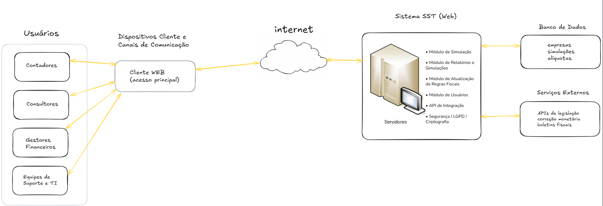

# Visão do produto

## Sistema de simulação tributária (SST)

<small>Versão 0.4</small>

---

## Histórico de revisões
| Data       | Versão | Descrição                      | Autor            |
|------------|--------|--------------------------------|------------------|
| 15/10/2025 | 0.1    | Versão inicial do documento                                                      | Arthur Araújo |
| 16/10/2025 | 0.2    | Adicionado novos stakeholders e Descrição de ambiente de uso                     | Davi Leite   |
| 17/10/2025 | 0.3    | Inclusão do diagrama do sistema e características principais                     | Gabriel Carvalho |
| 18/10/2025 | 0.4    | Adicionado tabela de principais necessidades do sistema e de usuários e atores.  | Davi Leite   |
| 18/10/2025 | 0.4.1  | Correções gerais de organização e semântica                                      | Davi Leite   |
| 18/10/2025 | 0.5    | Adicionando Licenciamento e instalação, e correções semânticas gerais          | Gabriel Carvalho |

---

## Sumário
- [Introdução](#introdução)
  - [Propósito](#propósito)
  - [Definições e abreviações](#definições-e-abreviações)
    - [Abreviações](#abreviações)
    - [Definições](#definições)
  - [Escopo do produto](#escopo-do-produto)
- [Posicionamento](#posicionamento)
  - [Oportunidade de negócios](#oportunidade-de-negócios)
  - [Descrição dos benefícios para os clientes e dos problemas resolvidos](#descrição-dos-benefícios-para-os-clientes-e-dos-problemas-resolvidos)
- [Descrição dos stakeholders e dos usuários](#descrição-dos-stakeholders-e-dos-usuários)
  - [Stakeholders](#stakeholders)
  - [Usuários e atores](#usuários-e-atores)
- [Descrição do ambiente de uso](#descrição-do-ambiente-de-uso)
  - [Ambiente de uso](#ambiente-de-uso)
  - [Necessidades principais quanto ao ambiente](#necessidades-principais-quanto-ao-ambiente)
- [Visão geral do produto](#visão-geral-do-produto)
  - [Visão geral](#visão-geral)
  - [Características e funcionalidades de alto nível](#características-e-funcionalidades-de-alto-nível)
  - [Custo e venda](#custo-e-venda)
  - [Licenciamento e instalação](#licenciamento-e-instalação)
  - [Restrições](#restrições) 

---

# Introdução

Esse documento de visão do produto (DVP) visa apresentar a visão geral do sistema de simulação tributária, detalhando o propósito, escopo, stakeholders, ambiente de uso e características principais do produto.

## Propósito

O propósito do DVP é fornecer uma visão clara e concisa do sistema de simulação tributária, que auxiliará empresas e profissionais a calcular e simular impostos de maneira eficiente e precisa. 

O documento destina-se a desenvolvedores, gerentes de projeto, stakeholders e qualquer pessoa envolvida no desenvolvimento e implementação do sistema, garantindo que todos tenham uma compreensão comum dos objetivos e funcionalidades do produto e sejam alinhados quanto às expectativas.

## Definições e abreviações
### Abreviações
| Abreviação | Descrição                                                                  |
| ---------- | -------------------------------------------------------------------------- |
| SAAS       | Software as a Service (Software como Serviço)                              |
| DVP        | Documento de Visão do Produto                                              |
| API        | Application Programming Interface (Interface de Programação de Aplicações) |
| UI         | User Interface (Interface do Usuário)                                      |
| UX         | User Experience (Experiência do Usuário)                                   |
| SST        | Sistema de Simulação Tributária                                            |
| MVP        | Minimum Viable Product (Produto Mínimo Viável)                             |

### Definições
| Termo            | Descrição                                                                                     |
| ---------------- | --------------------------------------------------------------------------------------------  |
| Simulação        | Processo de modelar o comportamento de um sistema real através de um modelo computacional.    |
| Alíquota         | Percentual aplicado sobre uma base de cálculo para determinar o valor do imposto devido.      |
| Base de cálculo  | Valor sobre o qual a alíquota é aplicada para calcular o imposto.                             |
| Tributação       | Sistema de arrecadação de impostos por parte do governo.                                      |
| Imposto          | Contribuição financeira obrigatória imposta pelo governo sobre renda, propriedade ou consumo. |
| Compliance       | Conformidade com leis, regulamentos e normas aplicáveis.                                      |
| Relatório        | Documento que apresenta informações detalhadas sobre um determinado assunto.                  |
| Simples nacional | Regime tributário simplificado para micro e pequenas empresas no Brasil.                      |
| Lucro presumido  | Regime tributário baseado em uma presunção de lucro para cálculo de impostos.                 |
| Lucro real       | Regime tributário onde os impostos são calculados com base no lucro efetivo da empresa.       |
| Web              | Tecnologia que permite o acesso a informações e serviços através da internet.                 |

## Escopo do produto 

O **SST** é um sistema web que tem por objetivo principal facilitar os processos de simulação e cálculos de tributação para profissionais da contabilidade. Será utilizado por contadores, consultores fiscais e gestores financeiros que necessitam de uma ferramenta eficiente para calcular impostos, gerar relatórios e garantir conformidade com as regulamentações fiscais vigentes.

# Posicionamento
## Oportunidade de negócios

Algumas oportunidades de negócios do SST são as seguintes:

- **Uso do sistema por assinatura**: Permite que o sistema seja usado por diversos clientes diferentes da área de contabilidade, mediante pagamento mensal, anual ou qualquer outro pacote disponível, oferecendo também planos diferentes de funcionalidades e preços, de maneira que seja acessível. 
- **Venda da licença do sistema junto com serviços de suporte e manutenção**: Oferece o sistema para empresas da área de contabilidade com pagamento único pela licença para o uso, mas pagamento contínuo por serviços relacionados a suporte e manutenção do mesmo (sem entrega do código-fonte).
- **Criação de ecossistema auxiliar**: Disponibilizar aos clientes um ecossistema de serviços e produtos relacionados ao sistema, como outras ferramentas de gestão, consultoria, etc. de maneira que o usuário do sistema não precise recorrer a ferramentas completamente diferentes da que está habituado a usar.

## Descrição dos benefícios para os clientes e dos problemas resolvidos
| Benefícios                                                        | Problemas resolvidos                           | Afetados                                              |
| ----------------------------------------------------------------- | ---------------------------------------------- | ----------------------------------------------------- |
| Cálculo automático de impostos                                    | Erros manuais no cálculo de impostos           | Contadores, consultores fiscais, gestores financeiros |
| Simulação de diferentes cenários tributários                      | Dificuldade em prever impactos fiscais         | Contadores, consultores fiscais, gestores financeiros |
| Geração de relatórios detalhados                                  | Falta de documentação adequada para auditorias | Contadores, gestores financeiros                      |
| Notificação automática sobre mudanças na legislação tributária    | Desatualização sobre leis fiscais              | Contadores, consultores fiscais                       |
| Possibilidade de atualização manual de alíquotas e regras fiscais | Desatualização de alíquotas e regras fiscais   | Contadores, consultores fiscais                       |

# Descrição dos stakeholders e dos usuários
## Stakeholders

| Stakeholder | Descrição | Papel |
| ----------- | --------- | ----- |
| Clientes | Empresas e profissionais da contabilidade que vão utilizar o sistema para prestar serviços relacionados à simulação e cálculo de tributos. | Usuários finais do sistema |
| Especialistas em legislação tributária | Profissionais com profundo conhecimento das leis fiscais e tributárias, responsáveis por garantir que o sistema esteja atualizado e em conformidade com as regulamentações vigentes. | Consultores fiscais, advogados especializados em direito tributário |
| Equipe de Banco de dados | Profissionais responsáveis por projetar, implementar e manter o banco de dados do sistema, garantindo a integridade, segurança e desempenho dos dados. | Administradores de banco de dados, engenheiros de dados |
| Gerente de projeto | Profissional responsável por coordenar as equipes de desenvolvimento, infraestrutura e suporte, garantindo que o projeto seja concluído dentro do prazo e orçamento estabelecidos. | Gerenciamento do projeto |
| Equipe de infraestrutura | Profissionais responsáveis por garantir que o sistema esteja hospedado, seguro e disponível para os usuários. | Administradores de sistemas, especialistas em segurança |
| Equipe de desenvolvimento | Profissionais responsáveis por desenvolver e fazer a manutenção do sistema | Engenheiros de software, designers |
| Equipe de suporte | Profissionais responsáveis por oferecer assistência técnica aos usuários do sistema | Suporte técnico |
| Equipe de marketing e vendas | Profissionais responsáveis por promover e vender o sistema | Marketing, vendas |

## Usuários e atores

| Usuário/Atores         | Descrição                                                                 | Responsabilidades                                              | Stakeholders Relacionados                  |
|------------------------|---------------------------------------------------------------------------|---------------------------------------------------------------|--------------------------------------------|
| Contadores             | Profissionais de contabilidade que utilizam o sistema para cálculos e simulações tributárias | Realizar simulações, calcular impostos, gerar relatórios      | Clientes                                   |
| Consultores fiscais    | Especialistas em legislação tributária que apoiam empresas e clientes      | Analisar cenários fiscais, propor estratégias tributárias      | Especialistas em legislação tributária      |
| Gestores financeiros   | Responsáveis pelo planejamento financeiro das empresas                     | Avaliar impactos fiscais, tomar decisões estratégicas          | Clientes                                   |
| Administradores do sistema | Usuários com permissões para gerenciar configurações e usuários         | Gerenciar acessos, configurar regras e parâmetros do sistema   | Equipe de desenvolvimento, suporte         |
| Suporte técnico        | Profissionais que auxiliam usuários em dúvidas e problemas técnicos        | Prestar suporte, solucionar problemas e registrar feedback     | Equipe de suporte                          |

# Descrição do ambiente de uso

## Ambiente de uso

O Sistema de Simulação Tributária (SST) opera em diferentes contextos profissionais, adaptando-se às necessidades específicas de cada cenário:

**Ambiente do Cliente**: Utilizado por contadores, consultores fiscais e gestores financeiros em escritórios de contabilidade, departamentos financeiros de empresas e consultorias. Os profissionais acessam o sistema através de navegadores web modernos (Chrome, Firefox, Edge ou Safari) em desktops, notebooks ou tablets. O acesso ocorre tanto em ambiente de escritório conectado à rede local quanto remotamente via internet, permitindo trabalho em home office ou durante atendimento a clientes. Neste ambiente, são realizadas as principais operações do sistema: cálculos tributários, simulações de cenários, comparação entre regimes fiscais, geração de relatórios e análises estratégicas. A autenticação é obrigatória e cada usuário possui permissões específicas de acordo com seu perfil profissional.

**Ambiente de Desenvolvimento**: Espaço técnico onde a equipe de desenvolvimento trabalha na criação, manutenção e evolução do sistema. Inclui servidores de desenvolvimento, repositórios de código-fonte, ferramentas de versionamento e ambientes de integração contínua. Neste contexto, desenvolvedores implementam novas funcionalidades, corrigem bugs, otimizam performance e adaptam o sistema às mudanças na legislação tributária. O ambiente possui banco de dados de desenvolvimento com dados sintéticos para testes de integração e validação de código antes da promoção para outros ambientes.

**Ambiente de Teste**: Ambiente isolado e controlado que replica as condições de produção para validação de atualizações e novas funcionalidades. Utilizado por testadores, analistas de qualidade e usuários-piloto selecionados para homologação de mudanças. Aqui são realizados testes de regressão, validação de cálculos após atualizações legislativas, testes de performance e simulações de carga. O ambiente de teste possui dados anonimizados baseados em cenários reais, permitindo validação precisa sem comprometer informações sensíveis. Acesso restrito mediante credenciais específicas e todas as atividades são registradas para rastreabilidade.

**Ambiente Administrativo**: Camada de gestão e configuração do sistema, acessada exclusivamente por administradores autorizados. Permite gerenciamento completo de usuários e permissões, configuração de parâmetros fiscais e alíquotas, atualização de tabelas tributárias, monitoramento de uso e performance do sistema, realização de backups e recuperação de dados, gestão de licenças e configuração de integrações com sistemas externos. O acesso é protegido por autenticação multifator e todas as operações são registradas em logs de auditoria detalhados. Este ambiente é fundamental para manutenção da conformidade legal e garantia da segurança e disponibilidade do sistema.

## Necessidades principais quanto ao ambiente

A seguir, é apresentada uma tabela que descreve as necessidades dos clientes com relação à qualidade, desempenho, segurança, usabilidade e confidencialidade do sistema SST, juntamente com sua prioridade, interesse, solução atual e soluções propostas:

| Necessidade                                                                                                                                              | Prioridade | Interesse                                                                                                                                                | Solução Atual                                                                                                                 | Soluções Propostas                                                                                                                                                                                                                                                       |
| -------------------------------------------------------------------------------------------------------------------------------------------------------- | ---------- | -------------------------------------------------------------------------------------------------------------------------------------------------------- | ----------------------------------------------------------------------------------------------------------------------------- | ------------------------------------------------------------------------------------------------------------------------------------------------------------------------------------------------------------------------------------------------------------------------ |
| **Qualidade:** O sistema deve ser confiável e livre de erros nos cálculos tributários.                                                                             | Alta       | Os profissionais contábeis precisam de precisão absoluta nos cálculos para evitar problemas fiscais com seus clientes.                    | Planilhas manuais e sistemas genéricos que não são especializados em tributação brasileira.                                                                     | Implementar testes automatizados rigorosos, validação de dados em múltiplas camadas e processos de garantia de qualidade específicos para legislação tributária.                                                                                                                                                          |
| **Desempenho:** O sistema deve processar cálculos e simulações rapidamente, mesmo com grandes volumes de dados.                                         | Alta       | Contadores frequentemente trabalham com prazos apertados e precisam de resultados rápidos para múltiplos clientes.                                                     | Sistemas lentos que exigem longos tempos de processamento para simulações complexas.                                         | Otimizar arquitetura do sistema com cache inteligente, processamento paralelo e consultas de banco de dados eficientes. Implementar infraestrutura em nuvem escalável.                                                                                                          |
| **Escalabilidade:** O sistema deve suportar crescimento do número de usuários, clientes e simulações simultâneas.                                         | Alta       | Escritórios de contabilidade em expansão precisam de um sistema que cresça junto com o negócio. | Sistemas desktop limitados a poucos usuários ou que apresentam degradação de performance com aumento de carga.                                                | Implementar arquitetura em nuvem com auto-scaling, balanceamento de carga e distribuição geográfica de servidores.                                                                                                                                                     |
| **Segurança:** O sistema deve proteger dados sensíveis de clientes e informações fiscais contra acesso não autorizado.                                             | Alta       | Dados tributários são extremamente sensíveis e seu vazamento pode resultar em graves consequências legais e de imagem.                                           | Sistemas com segurança básica ou armazenamento local sem criptografia adequada. | Implementar autenticação multifator, criptografia de dados em repouso e em trânsito (SSL/TLS), controle de acesso baseado em funções (RBAC), logs de auditoria completos e conformidade total com LGPD.                                                                                                                                                |
| **Usabilidade:** O sistema deve ter interface intuitiva, mesmo para usuários com conhecimento técnico limitado.                                         | Moderada   | Profissionais contábeis precisam focar em sua expertise fiscal, não em aprender sistemas complexos.                                         | Sistemas com interfaces desatualizadas, pouco intuitivas ou que exigem treinamento extensivo.                                                                                     | Desenvolver interface responsiva e moderna, com fluxos de trabalho otimizados, tutoriais interativos e documentação clara. Realizar testes de usabilidade com profissionais da área.                                                                                                                                    |
| **Tempo de resposta:** O sistema deve fornecer feedback imediato para operações comuns e alertas claros durante processamentos longos. | Alta   | Profissionais precisam saber o status de suas operações para gerenciar eficientemente seu tempo.            | Sistemas que travam sem feedback ou não informam o progresso de operações demoradas.                                                                      | Implementar indicadores de progresso, processamento assíncrono com notificações, e otimização de consultas para garantir resposta rápida nas operações mais frequentes.                                                                                                                      |
| **Confidencialidade:** O sistema deve garantir total privacidade das informações dos clientes e seus dados fiscais.                                           | Alta       | Escritórios de contabilidade lidam com informações estratégicas de negócios de seus clientes que devem permanecer confidenciais.                                             | Sistemas sem controles adequados de privacidade ou políticas de uso de dados não transparentes. | Implementar política de privacidade clara conforme LGPD, segregação de dados por cliente, controle granular de permissões, anonimização de dados para análises internas, e processos claros de consentimento e exclusão de dados. |
| **Disponibilidade:** O sistema deve estar disponível durante todo o horário comercial e períodos críticos de fechamento fiscal. | Alta | Contadores trabalham com prazos rígidos e não podem ter o trabalho interrompido por indisponibilidade do sistema. | Sistemas com downtimes frequentes ou manutenções não programadas em horários críticos. | Garantir SLA de 99% de disponibilidade, implementar redundância de servidores, backups automáticos, planos de disaster recovery e janelas de manutenção previamente agendadas fora de horários críticos. |
| **Atualização:** O sistema deve ser facilmente atualizado com mudanças na legislação tributária brasileira. | Alta | A legislação fiscal brasileira muda frequentemente e o sistema precisa refletir essas mudanças rapidamente. | Sistemas que exigem meses para incorporar mudanças legislativas ou dependem de atualizações manuais complexas. | Implementar arquitetura modular que permita atualizações rápidas de regras fiscais, notificações automáticas de mudanças legislativas, e mecanismo de atualização de alíquotas sem necessidade de reinstalação do sistema. |

# Visão geral do produto
## Visão geral

## Visão geral do produto
# Visão geral

O Sistema de Simulação Tributária (SST) é uma plataforma web especializada com o intuito vindo para facilitar os cálculos e as simulações de impostos, permitindo que profissionais da área da contabilidade e financeira realizem análises fiscais com maior precisão, agilidade para demonstrações de resultado para os stakeholders. 

O ambiente irá oferecer simulações de diferentes cenários tributários, geração de relatórios detalhados e atualização manual das regras fiscais conforme as legislações, em que vai garantir a conformidade com as normas legais vigentes.

Por ser totalmente web, o SST funciona é acessível online mediante assinatura digital. Ele não exige nenhum hardware específico, e pode ser usado em navegadores modernos, como Chrome e Edge, tanto em computadores quanto em dispositivos móveis para os usuários.

Portando, o nosso sistema SST pode se sincronizar a recursos externos, como APIs de legislação e bancos de dados com informações fiscais, tornando possível a atualização automática de alíquotas e normas tributárias, alertando para os usuários.

**Figura 1** - Visão geral do sistema SST

# Características e funcionalidades de alto nível

1. Cálculo automático de impostos: A primeira caracteristica e funcionalidade que o sistema deve permitir é o cáculo automático de impostos, que considerará diferentes tipos de tributos e parâmetros definido pelo usuario (contadores, consultores fiscais e gestores..)

1. Simulação de cenários tributários: ele deve possibilitar a simulação de diversos tipos de cenários tributários definidos pelo usuário, o qual irá comparar os resultados e tomar decisões estratégicas inteligente com base nos dados reais salvos

1. Geração de relatórios detalhados: terá responsabilidade de gerar relatórios detalhados com informações sobre os tributos, valores calculado, simulações feitas e resultados de comparação dentro do dashboard, além de uma linguagem simplificada para os stakeholders.

1. Notificações sobre mudanças na legislação: o Sistema irá alertar sobre as mudanças na legislação escolhida pro cenário tributário para os usuários, que possam impactar nos seus cálculos de alíquotas e regras fiscais, para que o usuário possa ajustar no sistema conforme as novas normas.

1. Segurança e privacidade de dados: O sistema deve garantir conformidade com a Lei Geral de Proteção de Dados (LGPD), criptografia com dados sensíveis, assegurando a privacidade e a proteção das informações inseridas pelos usuários

1. Interface intuitiva: O SST tem que apresentar uma interface simples e funcional, com o objetivo de facilitar a visualização e a usabilidade por contadores, consultores fiscais e gestores, mesmo sem conhecimentos técnicos avançados

1. Desempenho estável e responsivo: O sistema deve ter desempenho estável e responsivo com os dados e outras funcionalidades, assegurando rapidez nos cálculos e simulações, sem falhas ou interrupções

1. Escalabilidade e integração: O sistema tem e deve ser escalável, para permitir a integração com serviços externos, como APIs fiscais, e expansão de suas funcionalidades conforme as necessidades do usuário

## Custo e venda
### TO-DO

## Licenciamento e instalação

O produto SST será disponibilizado para os usuários no modelo de assinatura, podeno ela ser mensal ou anual, dependendo do pacote que o cliente deseja assinar, o qual vai garantir acesso remoto e contínuo ao sistema via navegador web. Os usuários não terão direito de adquirir o software via instalação local, mas sim o direito de uso temporário de dispositivo via web, confome o plano contratado. 

Alternativamente, o sistema poderá ser oferecido sob modelo de licença mediante a pagamento único. A sua instalação e manutenção do sistema serão realizadas de forma regular e integralmente pela equipe provedora, conforme pela demanda que o usuário solicitar, incluindo hospedagem em servidores, atualizações automáticas do sistema em geral e suporte técnico remoto sem disponibilização do código-fonte.

## Restrições 

- **Segurança**: Dados sensíveis exigem criptografia e conformidade com LGPD
- **Disponibilidade**: Sistema deve estar disponível 99% do tempo durante horário comercial
- **Backup**: Dados devem ser salvos automaticamente para evitar perda de informações
- **Auditoria**: Todas as operações devem ser registradas para fins de compliance
- **Acessibilidade**: Interface deve seguir padrões de acessibilidade web (WCAG 2.1)
- **Tempo**: O sistema deve ser desenvolvido e entregue, quer seja para uso como SAAS ou licença completa, no prazo estipulado no projeto, de maneira que o(s) cliente(s) tenham previsibilidade quanto ao uso do sistema
- **Orçamento**: O desenvolvimento do sistema deve respeitar o orçamento aprovado, evitando custos adicionais que possam comprometer a viabilidade financeira do projeto
- **Recursos computacionais**: O sistema deve ser otimizado para o poder computacional disponível atualmente no ambiente de implantação, mas deve também ser escalável para suportar aumentos futuros na demanda de processamento e armazenamento 

---

Data: 18 de outubro de 2025

**Validado por:**

<address>
<a href="mailto:davi@dag.com">Davi Leite</a> | Engenheiro de Software 
davi@dag.com 
dag.com 
Box 762, João Pessoa 
BRA
</address>

--- 

Criado em outubro de 2025 por **Arthur Araújo**